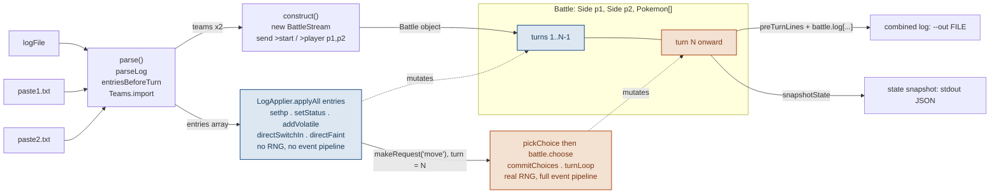

# Replay Then Roll

`recreate.js` touches one `Battle` object two different ways, in strict sequence, never both at once: first a `LogApplier` mutates it directly from the real log, entry by entry, with no dice involved — then, from turn N on, the real engine takes over and every choice is a genuine roll.

- **turns `1..N-1`** — direct mutation, no RNG
- **turn `N` onward** — real engine, real RNG

## The two-phase handoff

One `Battle`, two drivers. `LogApplier` (blue) walks the real log directly — `sethp`, `setStatus`, `addVolatile`, `directSwitchIn`, `directFaint` — writing state straight onto `Side` and `Pokemon` objects with no simulation involved. Once it reaches turn N, `battle.makeRequest('move')` generates a real choice request, and control passes to `playRandomly()` (amber), which feeds `pickChoice()`'s output through `battle.choose()` — the actual engine, actual dice, from there on.

Phase A never rolls dice; phase B never reads the original log again. The only thing that crosses the boundary is the `Battle` object itself, at exactly the point `makeRequest('move')` is called.

## File → object map

| file | exports | role |
|---|---|---|
| `event-log.js` | `parseLog`, `serializeLog`, `entriesBeforeTurn` | Real log text ↔ `EventLog` (`{header, turns}`); slices out everything before turn N. |
| `apply.js` | `LogApplier` | **Phase A.** Applies `EventLog` entries straight onto `Battle` / `Side` / `Pokemon`. No engine, no RNG. |
| `random-choice.js` | `pickChoice` | **Phase B.** Turns a `ChoiceRequest` into a legal move/switch string. Pure function, no side effects. |
| `recreate.js` | `recreateAtTurn`, `playRandomly`, `main` | Orchestrates all of the above — builds the `Battle`, runs the two phases, writes `--out`. CLI entry point. |
| `state-snapshot.js` | `snapshotState` | Reduces a live `Battle` to plain, comparable JSON — what gets printed to stdout. |
| `test-recreate.js` | *(script)* | Plays its own ground-truth game, then reuses `recreateAtTurn` / `playRandomly` and diffs `snapshotState` output against it. |
